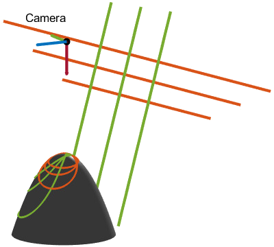
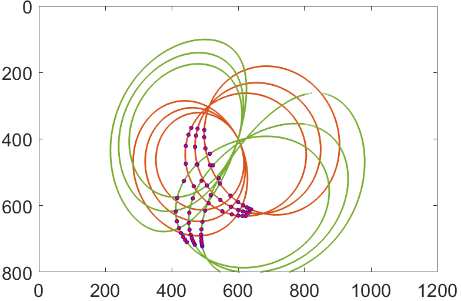
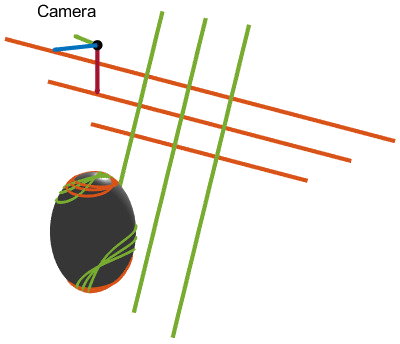
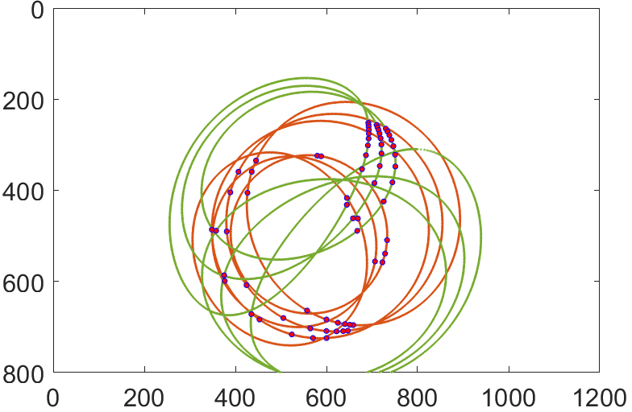

# A Unified Model for Line Projections in Catadioptric Cameras with Rotationally Symmetric Mirrors

<pre>




</pre>

**Authors:**<br>
[Pedro Miraldo](https://pmiraldo.github.io) <miraldo@merl.com><br>
Jose Pedro Iglesias <jose.iglesias@chalmers.se>

*IEEE/CVF Conference on Computer Vision and Pattern Recognition, 2022*

**Abstract:**<br>
Lines are among the most used computer vision features, in applications such as camera calibration to object detection. Catadioptric cameras with rotationally symmetric mirrors are omnidirectional imaging devices, capturing up to a 360 degrees field of view. These are used in many applications ranging from robotics to panoramic vision. Although known for some specific configurations, the modeling of line projection was never fully solved for general central and non-central catadioptric cameras. We start by taking some general point reflection assumptions and derive a line reflection constraint. This constraint is then used to define a line projection into the image. Next, we compare our model with previous methods, showing that our general approach outputs the same polynomial degrees as previous configuration-specific systems. We run several experiments using synthetic and real-world data, validating our line projection model. Lastly, we show an application of our methods to an absolute camera pose problem.


 [[Paper](https://openaccess.thecvf.com/content/CVPR2022/papers/Miraldo_A_Unified_Model_for_Line_Projections_in_Catadioptric_Cameras_With_CVPR_2022_paper.pdf "openaccess.thecvf.com")][[supplementary material](https://openaccess.thecvf.com/content/CVPR2022/supplemental/Miraldo_A_Unified_Model_CVPR_2022_supplemental.pdf "openaccess.thecvf.com")][[slides]( "pmiraldo.github.io")]


---

## Bibtex:

```
@InProceedings{Miraldo_2022_CVPR,
    author    = {Miraldo, Pedro and Iglesias, Jos\'e Pedro},
    title     = {A Unified Model for Line Projections in Catadioptric Cameras with Rotationally Symmetric Mirrors},
    booktitle = {IEEE/CVF Conference on Computer Vision and Pattern Recognition (CVPR)},
    year      = {2022},
    pages     = {15797-15806}
}
```

---

